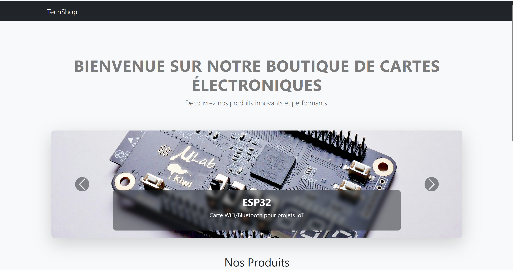
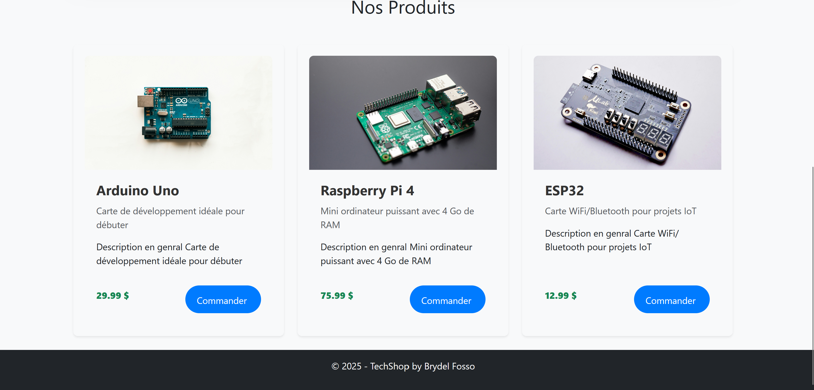
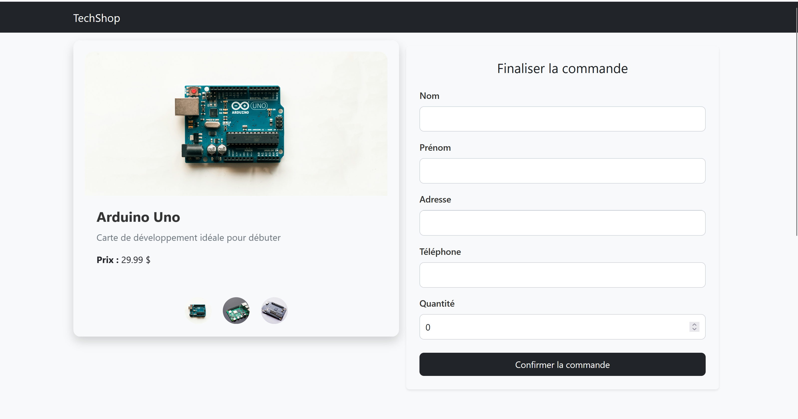
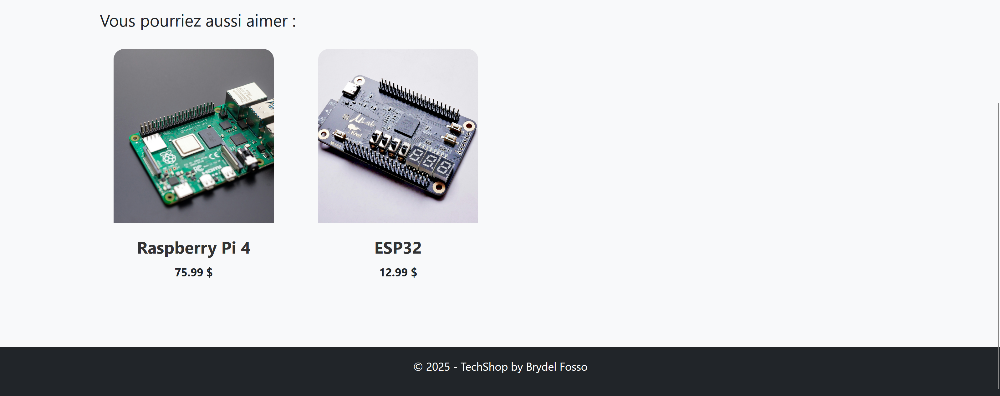
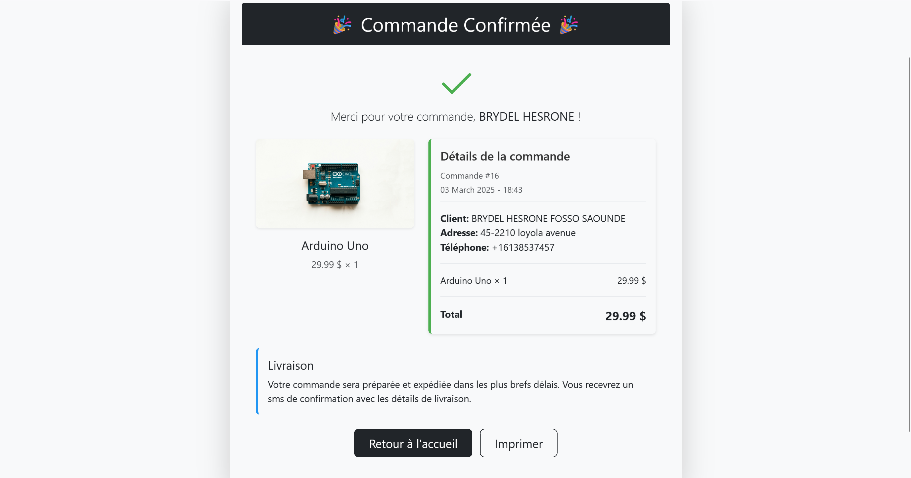

# Project-2 La Cité Collégiale


## 📌 Description
Ce projet est une application web de gestion de commandes d'achats de produits en ligne développée en **ASP.NET Core MVC**. Il permet aux utilisateurs de créer des commandes, d'afficher les détails des produits et de gérer une base de données clients, commandes et produits.

## 📜 Fonctionnalités
✅ Page principale avec affichage des produits.
✅ Formulaire de création de commande avec validation des données.
✅ Page de confirmation de commande.
✅ Gestion des clients et des produits.
✅ Base de données relationnelle avec **Entity Framework Core** et **MySQL**.
✅ Architecture MVC et utilisation du pattern DAO.

## 🏗 Architecture du Projet
```
├── Controllers/
│   ├── ClientController.cs
│   ├── CommandeController.cs
│   ├── HomeController.cs
│   └── ProduitController.cs
│
├── Data/
│   └── AppDbContext.cs
│
├── Models/
│   ├── Client.cs
│   ├── Commande.cs
│   ├── Produit.cs
│
├── Views/
│   ├── Home/Index.cshtml
│   ├── Commande/Create.cshtml
│   ├── Commande/Confirm.cshtml
│   ├── Shared/_Layout.cshtml
│
├── Repositories/
│   ├── ClientDAO.cs
│   ├── CommandeDAO.cs
│   ├── ProduitDAO.cs
│
├── wwwroot/
│   ├── css/
│   ├── images/
│   ├── js/
│
├── Program.cs
├── appsettings.json
├── README.md
```

## 🚀 Technologies Utilisées
- **ASP.NET Core 8.0**
- **Entity Framework Core** avec MySQL
- **Bootstrap 5**
- **HTML, CSS, JavaScript**
- **Pattern DAO (Data Access Object)**

## ⚙️ Installation et Exécution
1. **Cloner le dépôt**
```bash
git clone https://github.com/brydel/Project-2-la-cite-collegiale.git
cd Project-2-la-cite-collegiale
```
2. **Configurer la base de données**
   - Modifier la connexion MySQL dans `appsettings.json`
   ```json
   "ConnectionStrings": {
     "DefaultConnection": "Server=localhost;Port=3306;Database=ecommerce;User=root;Password=motdepasse;"
   }
   ```
3. **Appliquer les migrations**
```bash
dotnet ef database update
```
4. **Exécuter l'application**
```bash
dotnet run
```
5. **Accéder à l'application**
   - Ouvrir un navigateur et aller à `http://localhost:5000`

## 📷 Captures d'Écran
### 🏠 Page d'accueil


### 🏠 Variante de la page d'accueil


### 🛒 Page de commande


### 🛒 Variante de la page de commande


### ✅ Confirmation de commande


## 📄 Licence
Ce projet est sous licence MIT. Voir `LICENSE` pour plus d’informations.

---
### 👨‍💻 Développé par Brydel Fosso

